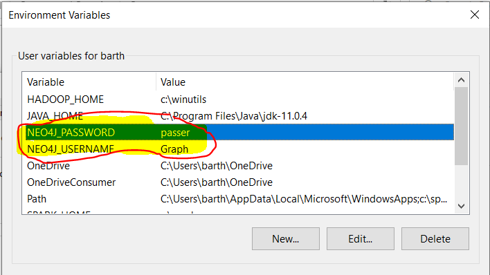
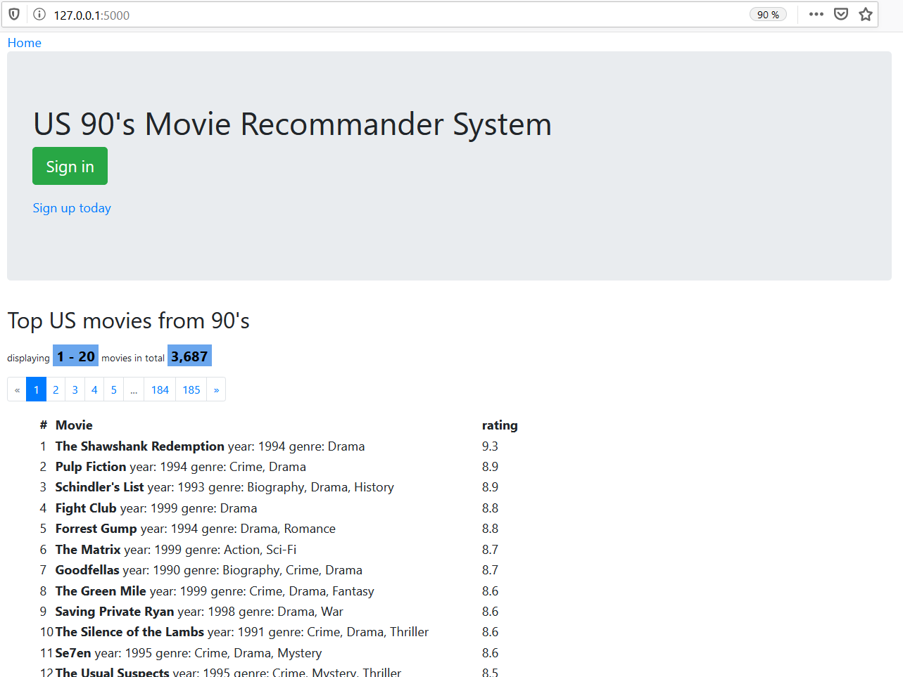
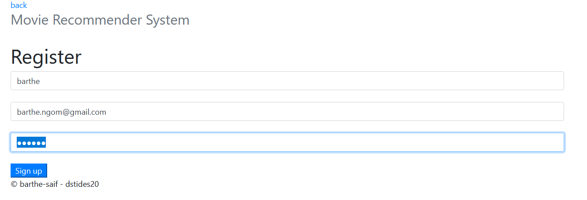
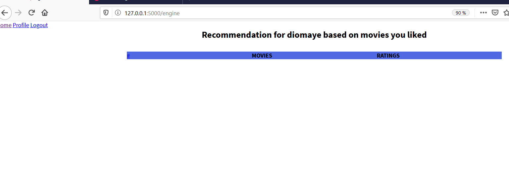
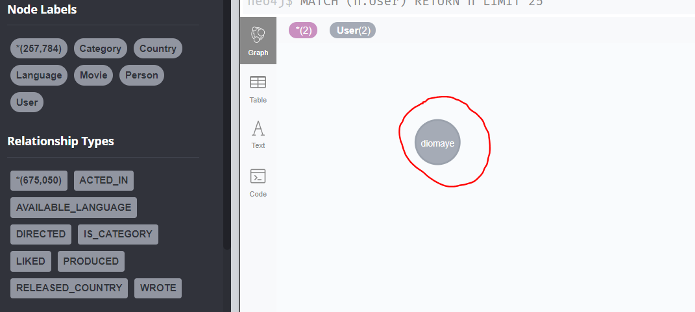
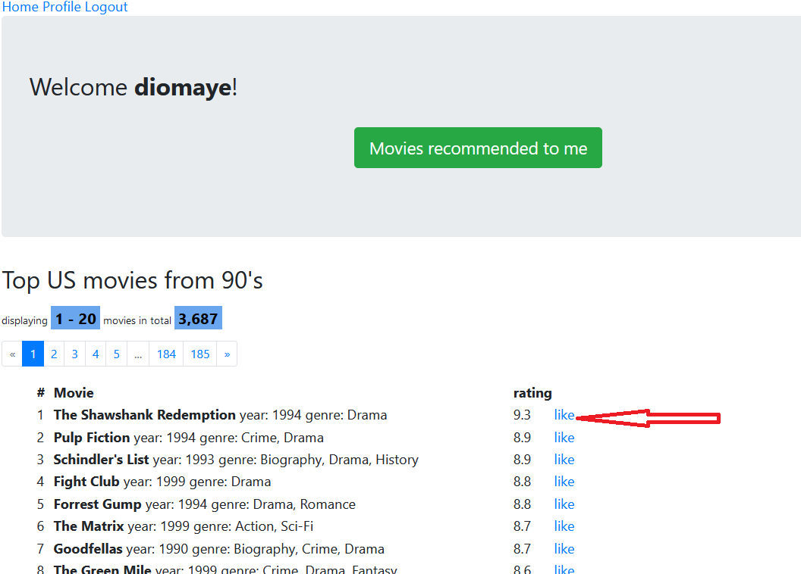
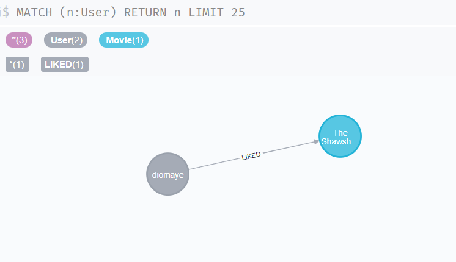
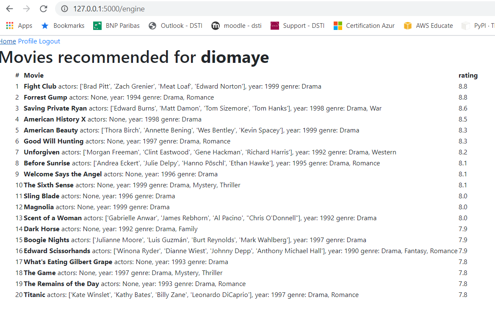

# Movie Recommender: with Neo4j and Flask
A little [flask](https://palletsprojects.com/p/flask/) application with [Neo4j](http://neo4j.com/download/other-releases/) graph database. The aim is to generate recommendation base on movies liked by a user.

## Usage

Make sure **Neo4j** is running first!

Make sure **Model creation** steps are effective. View `ImdbMovies.md` file.

Make sure to set environment variables `NEO4J_USERNAME` and `NEO4J_PASSWORD`
to your username and password, respectively:

* On windows:



* On linux:

```
$ export NEO4J_USERNAME=username
$ export NEO4J_PASSWORD=password
```

Or, set `dbms.security.auth_enabled=false` in `conf/neo4j-server.properties`.

Then:

```
git clone https://github.com/bngom/Movie-Recommender-Engine.git
cd Movie-Recommender-Engine
pip install virtualenv # You may need to add the installation folder into your PATH environment variable
virtualenv neoenv
neoenv\Scripts\activate.bat 
pip install -r requirements.txt
python app.py
```
## The application
[http://localhost:5000](http://localhost:5000)

The main page shows a list of US movies from 90’s. This is a simple recommendation based on popularity of the movies. This list is fetched from Neo4j.
The pagination shows only 20 movies per page, you can navigate through the list. 
You can log in or register to the application.  On registration the users are directly created in Neo4J.



* Register a user



Once the user registered the user is redirected in the main page with contextual information such as the username


You can click on the button Movies recommended to me to check that so far, no recommendation exists for the user



In Neo4J you will see that a new Node with label User is created



Once logged in the user will have a new option to Like a movie. 



When a user Like a movie a relation (User)-[:LIKED]->(Movie) is generated in Neo4j.



Based on the genre of the movies liked by the user, a recommendation is generated. 
Click again on the button `Movies recommended to me`.



## Perspectives

The recommendations made are only based on the genre of movies liked by the user. We also used only Cypher queries. With some Machine Learning this could be made more advanced by applying collaborative filtering or doing a hybrid recommendation associating both content based and collaborative filtering.
This also does not tackle when there is an unknown category of movies. 
All these are points of amelioration that could be deployed.


